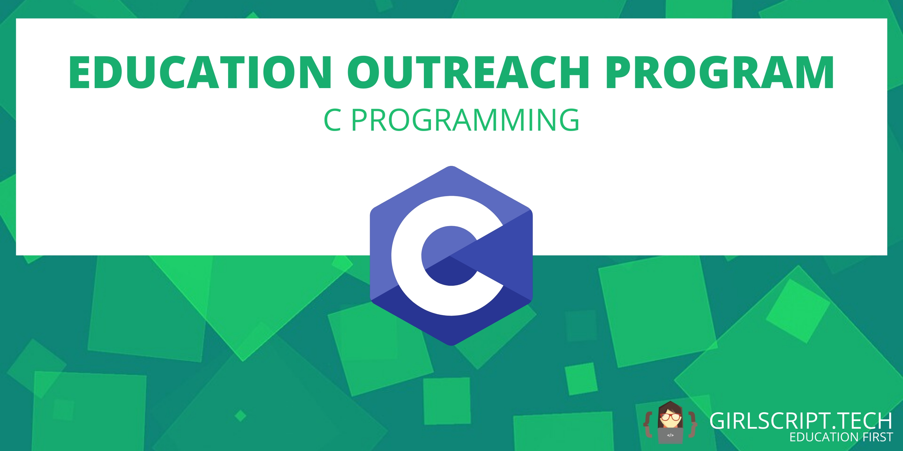

# C Programming : GirlScript Education Outreach

This is a 7 day crash course of C Programming which will cover almost all the basics required to kickstart C programming.

  ***

## Course Structure

DAY | Topics Covered 
--- | --- 
1 | [Introduction to C programming, Input , Output](DAY%201/Readme_of_day1.html) 
2 | [Operators in C, Typecasting](Day%202/readme_of_day2.html) 
3 | [Control statements](Day%203/Readme_of_day3.html) 
4 | [Functions](Day%204/Readme_of_day4.html) 
5 | [String and Arrays](Day%205/readme_of_day5.html) 
6 | [Pointers ](Day%206/Readme_of_day6.html)  
7 | [Structures]() 

